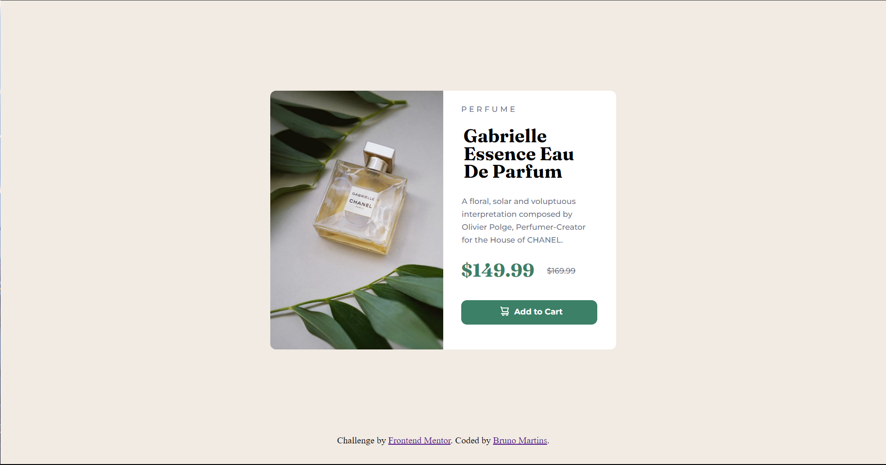
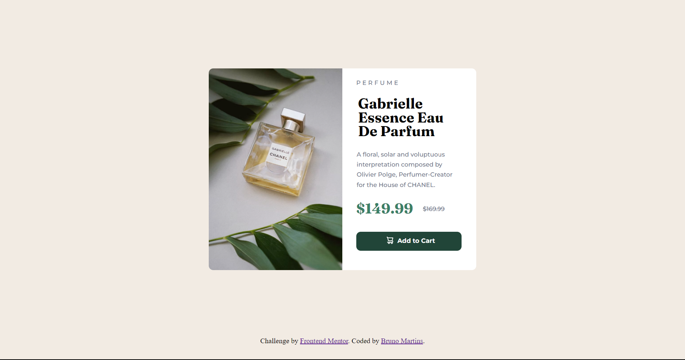

# Frontend Mentor - Solução do Product preview card component

Esta é uma solução para o desafio [Componente de preview de produto challenge on Frontend Mentor](https://www.frontendmentor.io/challenges/product-preview-card-component-GO7UmttRfa). Frontend Mentor challenges help you improve your coding skills by building realistic projects. 

## Sumário

- [O desafio](#O desafio)
- [Screeshots](#Screenshots)
- [Desenvolvido com](#Desenvolido com)
- [Autor](#Autor)

**Note: Delete this note and update the table of contents based on what sections you keep.**

### O desafio

O desafio era desenvolver esse componente de resumo de resultados e deixá-lo o mais próximo possível do design.

Os usuários deveriam ser capazes de:
- Visualizar o layout ideal para a interface, dependendo do tamanho da tela do seu dispositivo.
- Ver os estados de hover e foco para todos os elementos interativos na página.

### Screenshots

Este é o design oficial:
- Design desktop

- Botão ativo

- Deign mobile

Esta é a minha solução:

- Desktop

- Botão ativo

- Design mobile

### Desenvolvido com

- HTML5
- CSS
- Flexbox

## Autor

- Website - [Bruno Martins](https://www.github.com/3runoAM)
- Frontend Mentor - [@3runoAM](https://www.frontendmentor.io/profile/3runoAM)